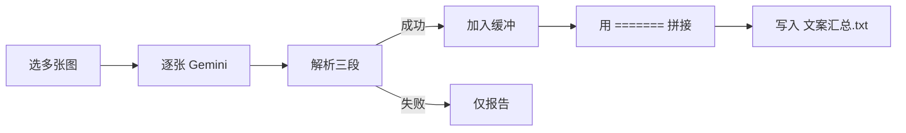

# Gemini 批量文案：合并为单个 txt

## 现状

[`gemini_copy.py`](d:\code\alexcard_tools\gemini_copy.py) 中 `process_one_image` → `save_reply_txt` 会为**每张图**写同目录同名 `.txt`；解析失败时还会 `write_raw_txt` 落原文。

## 目标行为

一次「批量获取文案」结束后，只生成 **一个** utf-8 `.txt`：

```text
【标题】
……

【宝贝描述】
……

【标签】
……
=======
【标题】
……

【宝贝描述】
……

【标签】
……
```

- 每条成功结果仍用现有 `format_copy_document`（已只含三段）。
- **不再**写 per-image 同名 txt；**不再**把解析失败的原文写入汇总文件。
- 多条之间用单独一行的 `=======` 分隔（首尾不加多余分隔符）。
- 失败张数仍记入报告区，但不进入汇总文件。

## 落盘约定（默认）

- 路径：所选图片**公共父目录**下的 `文案汇总.txt`（若图片都在同一文件夹则即该文件夹；跨目录则用第一张图所在目录）。
- 若文件已存在：**覆盖**写入本次整批结果（一次批处理 = 一个文件内容）。
- 若本批全部失败：不创建/不覆盖汇总文件，报告区说明「无成功文案可保存」。

## 改动点

### 1. [`gemini_copy.py`](d:\code\alexcard_tools\gemini_copy.py)

- 新增 `batch_txt_path(image_paths) -> str`：按上面规则定路径。
- 新增 `write_batch_copy_txt(dest, documents: list[str])`：用 `\n=======\n` 拼接各条 `format_copy_document` 结果并写入。
- 调整 `process_one_image`：返回解析后的 `ParsedCopy`（或格式化字符串），**不再内部写文件**；失败仍抛异常。
- 调整 `_do_batch`：收集成功条目 → 批末一次写入汇总 txt → 报告行改为如 `foo.png - 已解析`，批末追加 `已写入 文案汇总.txt（N 条）`。
- 可删或停用 per-image 的 `write_copy_txt` / `write_raw_txt` / `save_reply_txt` 调用路径（保留 `parse` / `format` 纯函数）。

### 2. [`main.py`](d:\code\alexcard_tools\main.py)

- 按钮说明文案改为「结果合并保存为所选图片目录下的 文案汇总.txt」。
- `on_done` 汇总提示可附带输出路径（若 `_do_batch` / 回调带回路径）。

## 数据流



## 不做

- 不改 Playwright 上传/等待逻辑。
- 不弹另存为对话框（固定 `文案汇总.txt`）。
