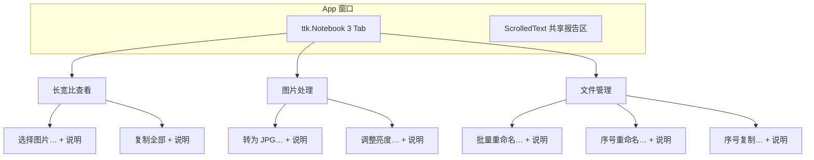

# Tab 分类 UI 重构计划

## 现状

[`main.py`](D:/code/alexcard_tools/main.py) 中 `App.__init__` 将所有 7 个按钮横向堆叠在一个 `tk.Frame` 里，下方只有一条全局 hint 和共享的 `ScrolledText` 报告区。无 Tab，功能说明仅靠顶部 hint 覆盖「选择图片」场景。

```520:555:D:/code/alexcard_tools/main.py
        bar = tk.Frame(self, padx=8, pady=8)
        bar.pack(fill=tk.X)
        # ... 7 个 tk.Button 横向 pack ...
        hint = ("每行：文件名 - 比例 ...")
        tk.Label(self, text=hint, ...)
        self.text = scrolledtext.ScrolledText(...)
```

## 目标布局



每个 Tab 内纵向排列，结构为：

```
[按钮]
说明文字（灰色小字，左对齐，自动换行）
（间距）
[下一个按钮]
...
```

底部 `ScrolledText` 保持不变，所有 Tab 的操作结果仍写入同一报告区。

## Tab 分类与按钮说明文案

| Tab | 按钮 | 说明文字 |
|-----|------|----------|
| **长宽比查看** | 选择图片… | 选择多张图片，在下方报告区显示文件名、长宽比（短边=1）和像素尺寸；无法读取的文件会标注错误。 |
| | 复制全部 | 将报告区的全部文本复制到系统剪贴板。 |
| **图片处理** | 转为 JPG… | 选择图片和输出文件夹，将图片转换为 JPG（透明背景填充白色），并在报告区显示每张的转换结果。 |
| | 调整亮度… | 选择图片和输出文件夹，按倍数（0.01~10，1.0 不变）调整亮度后保存，保留原格式。 |
| **文件管理** | 批量重命名… | 选择同文件夹下的图片，按交替规则重命名（如 1→1, 1-1, 2, 2-2…），预览确认后原地重命名。 |
| | 序号重命名… | 选择同文件夹下的图片，按连续序号或配对序号重命名（1→1,2,3 或 1-1→1-1,2-2,3-3），预览确认后原地重命名。 |
| | 序号复制… | 选择图片，仅复制纯数字文件名（1、2、3…，不含 1-1、2-2）到指定文件夹，预览确认后复制。 |

## 实现步骤（仅改 [`main.py`](D:/code/alexcard_tools/main.py)）

### 1. 引入 ttk

```python
from tkinter import filedialog, messagebox, scrolledtext, simpledialog, ttk
```

### 2. 新增辅助函数 `_add_tool_row`

在 `App` 类之前添加一个小函数，避免重复布局代码：

```python
def _add_tool_row(parent: tk.Widget, text: str, command, description: str) -> None:
    block = tk.Frame(parent, padx=12, pady=8)
    block.pack(fill=tk.X, anchor="w")
    tk.Button(block, text=text, command=command).pack(anchor="w")
    tk.Label(
        block, text=description, anchor="w", justify="left",
        wraplength=660, fg="#555555", font=("", 9),
    ).pack(anchor="w", pady=(4, 0))
```

- `wraplength=660` 配合窗口宽度 720 实现自动换行
- 说明文字用略小字号和灰色，与按钮区分

### 3. 重构 `App.__init__` 布局

- 删除现有 `bar` 横向按钮栏和全局 `hint` Label
- 创建 `notebook = ttk.Notebook(self)` 并 `pack(fill=tk.X, padx=8, pady=8)`
- 创建 3 个 `tk.Frame` 作为 Tab 页，分别 `notebook.add(frame, text="...")`
- 在每个 Tab 内调用 `_add_tool_row`，传入对应 handler（现有 `self.on_*` 方法不变）
- 窗口标题可微调为 `"批量图片工具"` 或保留原标题（建议改为 `"批量图片工具"` 以匹配多 Tab 定位）
- 适当增大默认高度（如 `720x520`）以容纳 Tab 内容

### 4. 业务逻辑零改动

所有 `on_select_images`、`on_copy_all`、`on_convert_to_jpg` 等 handler 及底层函数（`build_report`、`convert_to_jpg` 等）**不做任何修改**，仅 UI 入口位置变化。

### 5. 验证

- 本地运行 `python main.py`，逐 Tab 点击每个按钮确认：
  - Tab 切换正常
  - 说明文字显示完整、换行正常
  - 各功能行为与重构前一致
  - 报告区在所有 Tab 下共享且正常更新

## 影响范围

- **修改文件**：仅 [`main.py`](D:/code/alexcard_tools/main.py)（约 40~50 行 UI 代码变更）
- **不修改**：PyInstaller spec、build 脚本、业务逻辑函数
- **风险**：低；纯 UI 重构，无逻辑变更
