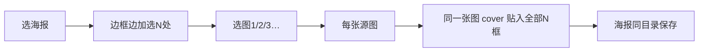

# 单图多次贴入

## 流程

1. 选一张海报模板  
2. 弹窗预览：**边框边加**——每确认一框可继续，点「完成框选」结束（至少 2 处）  
3. 多选图片或选文件夹；只取纯数字 stem（`1`、`2`、`3`…），按数字排序  
4. **每张源图** → 复制海报 → 将该图用现有 `fit_cover` 贴入全部 N 个框 → 保存一张成品  
5. 输出命名复用 [`poster_compose_output_path`](d:\code\alexcard_tools\main.py)：`poster_{stem}.png`，海报同目录  

与「双图贴入」的区别：双图是主/副图各进一框、按组配对；本功能是**同一张图填满所有框**，一张源图对应一张成品。

## UI（仅改 [`main.py`](d:\code\alexcard_tools\main.py)）

在「海报双图贴入…」下方 `_add_tool_row`：

- 按钮：`单图多次贴入…`
- 说明：框选海报多处位置；每张图（`1/2/3…`）贴入全部位置，各生成一张海报，保存在原海报同目录

`App.on_poster_single_multi` 顺序：

1. `askopenfilename` 选海报  
2. `ask_poster_regions_multi(parent, poster_path)` → `list[PosterBox]` 或取消  
3. 多选图 / 或目录（与双图相同 yes/no）  
4. 过滤 `_is_main_image_stem`，按 `int(stem)` 排序；无有效图则报错  
5. `build_poster_single_multi_report(...)` → 报告区 + 成功/失败弹窗  

## 框选对话框

新建 `ask_poster_regions_multi`（可从现有 `ask_poster_regions` 抽出公共 Canvas 逻辑，或复制后改步数逻辑）：

- 交互与双框选相同（缩放预览、拖拽矩形、确认本框、撤销、取消）  
- **不固定步数**：确认本框后 `step += 1`，提示「请框选位置 k」  
- 底部增加「完成框选」：已确认框数 `< 2` 时警告；否则映射回原图像素并返回 `list[PosterBox]`  
- 「确认本框」只锁定当前框并进入下一位置，不自动关闭对话框  

## 合成与保存

复用已有 `fit_cover` / `paste_into_poster` / `poster_compose_output_path` / JPEG→RGB 与 PNG 导出逻辑。

| 函数 | 作用 |
|------|------|
| `compose_poster_single_multi(poster_path, img_path, boxes, dest)` | 打开海报副本，同一张图依次 `paste_into_poster` 到每个 box，存 PNG |
| `build_poster_single_multi_report(poster_path, image_paths, boxes)` | 对每张源图调用上面；返回 report / ok / fail |

实现要点：

- 每张源图 `Image.open(poster).copy()`，避免改原文件  
- 有 alpha 时走现有 mask paste  
- 框数 N ≥ 2；图片数量不限（至少 1 张）  

## 改动范围

仅 [`main.py`](d:\code\alexcard_tools\main.py)：多框选对话框 + 合成/报告 helper + Tab 按钮与 handler。不改双图贴入行为，不新增依赖。
