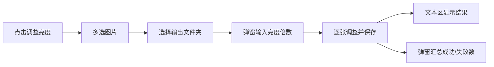

# 图片亮度批量调整

## 背景

项目为单文件桌面应用 [`main.py`](d:\code\alexcard_tools\main.py)，已有「选择图片（长宽比）」和「转为 JPG」两个批量流程。新功能沿用同一模式：**纯函数处理逻辑 + 工具栏按钮 + 文本区报告 + 完成弹窗**。

你已确认：
- **输出**：保存到用户选择的输出文件夹，**保留原格式**（非 JPG 转换）
- **亮度输入**：弹窗输入倍数（1.0=不变，1.2=变亮 20%，0.8=变暗 20%）



## 实现方案

### 1. 新增纯函数（`build_convert_report` 附近）

**`adjust_brightness(im: Image.Image, factor: float) -> Image.Image`**

使用 Pillow `ImageEnhance.Brightness`，并正确处理透明通道：

- `RGBA` / `LA`：仅对 RGB 部分应用亮度，**保留原 alpha 通道**（避免透明区域被错误提亮）
- `P`（含透明 GIF/PNG）：先转 `RGBA`，再走上述逻辑
- 其他模式（`RGB`、`L`、`CMYK` 等）：直接 `ImageEnhance.Brightness(im).enhance(factor)`

**`brightness_output_path(src_path, out_dir) -> str`**

- `{out_dir}/{原文件名}`（保留原扩展名，与 JPG 功能的 `jpg_output_path` 对称）

**`save_image(im, dest_path, src_path) -> None`**

按源文件扩展名保存，JPEG 使用 `quality=90`（与现有 `convert_to_jpg` 一致），其余格式由 Pillow 根据扩展名推断：

| 扩展名 | 保存方式 |
|--------|----------|
| `.jpg` / `.jpeg` | `save(..., "JPEG", quality=90)` |
| `.png` | `save(..., "PNG")` |
| `.webp` | `save(..., "WEBP", quality=90)` |
| 其他 | `save(dest_path)` |

**`adjust_image_brightness(src_path, out_dir, factor) -> tuple[bool, str]`**

- 打开图片 → `adjust_brightness` → `os.makedirs(out_dir, exist_ok=True)` → `save_image`
- 成功：`"文件名 - 已保存 (宽×高, 倍数×factor)"`
- 失败：`"文件名 - 错误: {e}"`（与现有错误风格一致）
- **GIF 动图**：仅处理第一帧（与 JPG 功能行为一致，无需额外依赖）

**`build_brightness_report(paths, out_dir, factor) -> tuple[str, int, int]`**

- 批量调用 `adjust_image_brightness`，返回 `(report_text, ok_count, fail_count)`（复用 `build_convert_report` 结构）

### 2. UI 改动

在 [`App`](d:\code\alexcard_tools\main.py) 工具栏「转为 JPG…」旁增加按钮：

```python
tk.Button(bar, text="调整亮度…", command=self.on_adjust_brightness).pack(side=tk.LEFT, padx=(6, 0))
```

**`on_adjust_brightness()` 流程：**

1. `filedialog.askopenfilenames(title="选择要调整的图片", filetypes=IMAGE_FILETYPES)` — 无选择则返回
2. `filedialog.askdirectory(title="选择输出文件夹")` — 无选择则返回
3. `simpledialog.askfloat("亮度调整", "亮度倍数（1.0=不变，>1变亮，<1变暗）：", initialvalue=1.0, minvalue=0.01, maxvalue=10.0)` — 取消或无效则返回
4. 若 `factor == 1.0`，`messagebox.askyesno` 确认是否继续（避免无意义批量复制）
5. 调用 `build_brightness_report(paths, out_dir, factor)`
6. 结果写入 `self.text`，`messagebox.showinfo` 汇总成功/失败数

新增 import：`from tkinter import simpledialog`；`from PIL import ImageEnhance`

### 3. 边界情况

| 场景 | 处理方式 |
|------|----------|
| 透明 PNG/WebP | 只调 RGB，alpha 不变 |
| 不同目录同名文件 | 输出目录中后者覆盖前者；报告仍逐条记录 |
| 输出目录不存在 | `os.makedirs(out_dir, exist_ok=True)` |
| 单张失败 | 捕获异常，继续处理其余文件 |
| 倍数为 1.0 | 弹窗确认是否继续 |
| 倍数 ≤ 0 | `askfloat` 的 `minvalue=0.01` 阻止 |

### 4. 无需改动

- [`requirements.txt`](d:\code\alexcard_tools\requirements.txt)：`ImageEnhance` 已包含在 Pillow 中
- PyInstaller 打包（[`build_exe.bat`](d:\code\alexcard_tools\build_exe.bat)、[`ImgAspectRatio.spec`](d:\code\alexcard_tools\ImgAspectRatio.spec)）：入口仍为 `main.py`

## 核心代码示意

```python
from PIL import ImageEnhance

def adjust_brightness(im: Image.Image, factor: float) -> Image.Image:
    if im.mode in ("RGBA", "LA"):
        rgb = ImageEnhance.Brightness(im.convert("RGB")).enhance(factor)
        result = rgb.convert("RGBA")
        result.putalpha(im.split()[-1])
        return result
    if im.mode == "P":
        return adjust_brightness(im.convert("RGBA"), factor)
    return ImageEnhance.Brightness(im).enhance(factor)
```

## 验证方式

1. 运行 `python main.py`
2. 准备样本：普通 JPG、透明 PNG、WebP、偏暗/偏亮各一张
3. 点击「调整亮度…」→ 多选 → 选输出目录 → 输入 `1.5` 或 `0.7`
4. 确认：
   - 输出目录生成对应文件，格式与源一致
   - 透明 PNG 的透明区域未被破坏
   - 文本区逐条显示结果（含倍数）
   - 弹窗成功/失败计数正确
5. 原有「选择图片」「复制全部」「转为 JPG」功能不受影响
