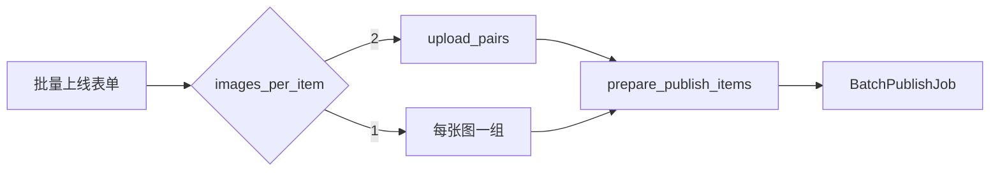

# 批量上线：图片张数可选

## 行为

| 模式 | 分组规则 |
|------|----------|
| **两张图**（默认） | 现有 [`upload_pairs`](d:\code\alexcard_tools\main.py)：主图 `1/2/3…` + 副图配对 |
| **一张图** | 目录内每张图单独一组（已按文件名排好序），每件只上传 1 张 |

文案条数仍须与「组数」一致；[`xianguanjia._upload_images`](d:\code\alexcard_tools\xianguanjia.py) 已支持任意长度 `images` 元组，无需改上传逻辑。

## 改动（仅 [`main.py`](d:\code\alexcard_tools\main.py)）

1. **`BatchPublishParams`** 增加字段 `images_per_item: Literal[1, 2]`（默认 2）。

2. **表单 UI**（`ask_batch_publish_dialog`，图片目录行附近）：
   - 单选：`两张图（主图+副图）` / `一张图`
   - 提示文案随选择切换（主副配对说明 vs「每张图对应一件商品」）
   - 草稿 JSON 持久化 `images_per_item`（`"1"` / `"2"`），缺省按 2

3. **`prepare_publish_items`**：
   - `images_per_item == 2` → 仍调 `upload_pairs`
   - `images_per_item == 1` → `[(p,) for p in params.image_paths]`
   - 组数与文案条数校验不变

4. **报告行**：例如  
   `图片目录：…（N 张，共 M 组；一张图）` / `…；主图+副图`

海报双图、Gemini 等其它入口不改。
