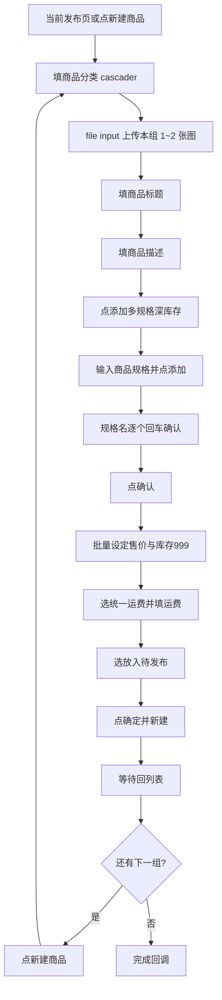

# 闲管家 · 批量上线自动填表

## 起点与约定

- 用户先点「打开闲管家」登录，并**手动进入第一件的「新建商品」发布页**；浏览器保持不关。
- 点「批量上线…」填完弹窗后开始自动化：**第一件直接在当前发布页填写**；每件点「确定并新建」后回到列表，再点「新建商品」处理下一件。
- 图片按 [`upload_pairs`](d:\code\alexcard_tools\main.py) 两两一组；文案用 `=======`（[`BATCH_SEPARATOR`](d:\code\alexcard_tools\gemini_copy.py)）切分；**组数必须等于文案条数**，否则整批中止并报错。
- 弹窗字段已齐（[`BatchPublishParams`](d:\code\alexcard_tools\main.py)），本版只接 Playwright，不改弹窗 UI。

## 数据准备（`main.py` / 小工具）

新增解析（可放 `main.py` 或抽到 `xianguanjia.py`）：

1. 读 `params.copy_txt`，按 `BATCH_SEPARATOR` 切分为多段，每段用已有 [`parse_gemini_copy`](d:\code\alexcard_tools\gemini_copy.py) 得到 `title` / `description` / `tags`。
2. `pairs = upload_pairs(params.image_paths)`；`len(pairs) == len(copies)` 才继续。
3. 描述正文：

```text
【宝贝描述】内容

【标签】内容

desc_suffix（若有）
```

三段之间各空一行（无 suffix 则只拼前两段）。

## Playwright：扩展 [`xianguanjia.py`](d:\code\alexcard_tools\xianguanjia.py)

对齐 Gemini 的 `submit_*` 队列模式，新增 `submit_batch_publish(params, ...)`，在已有 `_page` 上串行执行。若会话未打开（`_context_alive()` 为假），立即 `on_error` 提示先打开闲管家。

### 单件填表步骤（选择器按你提供的 DOM）



| 步骤 | 操作要点 |
|------|----------|
| 分类 | `.custom-cascader.category-opt input.el-input__inner`：填入 `category`，等下拉出现后点匹配项（优先精确/包含文本） |
| 图片 | `.upload-demo input.el-upload__input`：`set_input_files(本组路径)`；每组 2 张（末组可 1 张） |
| 标题 | `input[placeholder*="请输入商品标题"]` ← `copy.title`（超长则截到页面限制前再填，报告区记警告） |
| 描述 | `textarea[placeholder="请输入商品描述"]` ← 上述拼接文案 |
| 开规格弹窗 | 点含「添加多规格深库存」的 `.sku-add-btn` |
| 规格属性 | 弹窗内 `input[placeholder*="商品规格1"]` 填 `spec_attr`，点「添加」按钮 |
| 规格值 | 对每个 `SpecPrice.name`（不含价格）填入后按 Enter；再点「确认」 |
| 批量设价 | 在规格表格区域按名称匹配行，填对应 `price`；库存一律 `999`（优先走「批量设定」若 DOM 稳定，否则逐行填） |
| 运费 | 点「统一运费」radio（`value="2"`），在相邻运费输入框填 `shipping` |
| 发布状态 | 点「放入待发布」radio（`value="4"`） |
| 提交 | 点「确定并新建」；等待列表页出现「新建商品」按钮 |
| 下一件 | 点 `.newly-built` / 含「新建商品」的按钮，等待发布表单就绪后再循环 |

每件开始/成功/失败向 `on_progress` 打日志（第 i/N、标题、错误）。单件失败：**中止后续**（避免错位配对），已成功件数在 `on_done` 汇总。

### 会话队列

扩展 `_loop` 支持 `"batch_publish"` 命令；**不要**在批量过程中 `goto(LOGIN_URL)`。`close` 行为不变。

## UI 接线 [`main.py`](d:\code\alexcard_tools\main.py)

- `on_batch_publish`：弹窗通过后校验会话忙闲 → 解析文案+配对 → `_xg_busy=True` → `submit_batch_publish`。
- 更新「批量上线…」按钮说明：去掉「本版不上架」；提示需先登录并打开第一件发布页。
- 报告区写进度；完成后 `messagebox` 成功/失败数。

## 明确不做

- 不改弹窗字段布局。
- 不自动打开登录页或猜新建商品 URL。
- 不实现「取消批量」中途打断（可后续加）。

## 改动文件

- [`xianguanjia.py`](d:\code\alexcard_tools\xianguanjia.py)：解析辅助可内联；`submit_batch_publish` + 填表实现。
- [`main.py`](d:\code\alexcard_tools\main.py)：`on_batch_publish` 真正调用会话；文案切分校验；文案说明。
- 复用 [`gemini_copy.py`](d:\code\alexcard_tools\gemini_copy.py) 的 `BATCH_SEPARATOR`、`parse_gemini_copy`（只读 import）。
