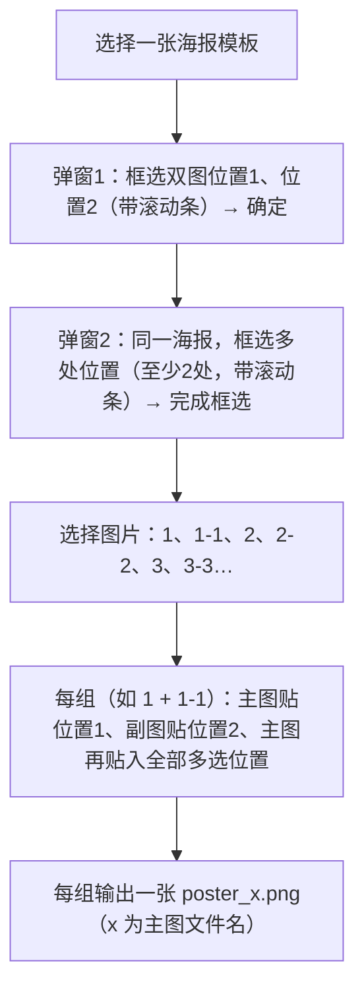

# 组合贴入功能（合并双图贴入与单图多次贴入）

所有改动集中在 [main.py](main.py)，原有「海报双图贴入」「单图多次贴入」按钮保留不动。

## 功能流程



## 具体改动

### 1. 给双图框选弹窗加滚动条

`ask_poster_regions`（[main.py](main.py) 第 582-744 行）目前 Canvas 无滚动条，海报过高时框不到下方。参照 `ask_poster_regions_multi`（第 750-954 行）的做法改造：

- Canvas 外套 `canvas_frame`，加竖向 `Scrollbar` 与 `scrollregion`，绑定鼠标滚轮
- 鼠标事件坐标改用 `canvas.canvasx/canvasy` 换算（同多框版的 `event_xy`）

此改造同时惠及原「海报双图贴入」入口。

### 2. 新增组合合成函数（纯逻辑）

在 `compose_poster_single_multi` 之后新增：

```python
def compose_poster_combined(
    poster_path, img1_path, img2_path,
    box1, box2, multi_boxes, dest_path,
) -> tuple[bool, str]
```

逻辑：打开海报（JPG 先 `prepare_for_jpeg`）→ `paste_into_poster` 主图到 box1、副图到 box2 → 主图再依次贴入 `multi_boxes` 全部位置 → 保存 PNG。复用现有 `fit_cover` / `paste_into_poster`。

再新增批量报告函数：

```python
def build_poster_combined_report(
    poster_path, pairs, box1, box2, multi_boxes,
) -> tuple[str, int, int]
```

遍历 `pairs`（来自现有 `upload_pairs`），每组校验有 2 张图，输出路径用现有 `poster_compose_output_path`（poster_主图名.png，存海报同目录）。

### 3. 新增 App 处理方法 `on_poster_combined`

流程串联（参照 `on_poster_compose` 第 1501-1554 行）：

1. `filedialog.askopenfilename` 选择海报模板
2. `ask_poster_regions(self, poster_path)` 框选双图两处位置，取消则退出
3. `ask_poster_regions_multi(self, poster_path)` 框选多处位置（沿用至少 2 处限制），取消则退出
4. 选图（文件夹或多选文件，同现有逻辑），`upload_pairs` 配对并校验每组恰好 2 张
5. `build_poster_combined_report` 合成，结果写入报告区并弹完成提示

### 4. 新增入口按钮

在「图片处理」标签页 `_add_tool_row`（第 1345-1372 行附近）追加一行：

- 按钮文本：「组合贴入…」
- 说明：选择海报后先框选双图两处位置，再框选多处位置；主图（1、2、3…）贴位置1并贴入全部多选位置，副图（1-1、2-2…）贴位置2；每组生成一张海报，保存在原海报同目录（poster_x.png）。

## 不改动的部分

- `upload_pairs` 配对规则（纯数字为主图，副图按名排序一一配对）原样复用
- 原「海报双图贴入」「单图多次贴入」两个按钮及其流程保留
- 输出命名与目录规则沿用 `poster_compose_output_path`