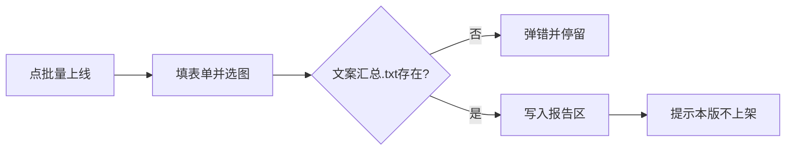

# 闲管家 · 批量上线（表单收集）

## 范围（本版 = 你选的 1A）

- 新增按钮：`批量上线…`
- 弹窗填写：**商品分类**、**规格名称**（多个用 `|` 分隔）、**运费**；并**选图**
- 校验所选图片同目录存在 [`文案汇总.txt`](d:\code\alexcard_tools\gemini_copy.py)（复用 `BATCH_TXT_NAME` / `batch_txt_path`）
- 确定后把参数与路径写入下方报告区；`messagebox` 提示本版仅记录、不上架网页
- **不做** goofish.pro 自动填表 / 提交

## UI

在 [`main.py`](d:\code\alexcard_tools\main.py) Tab「闲管家上线」中，紧挨「打开闲管家」增加一行（沿用 `_add_tool_row`）：

- 按钮：`批量上线…`
- 说明：填写分类/规格/运费并选图；需同目录已有 Gemini 产出的 `文案汇总.txt`；本版只记录参数，不上架网页。

对话框 `ask_batch_publish_dialog`（对齐现有 `ask_gemini_batch_dialog`）：

| 控件 | 行为 |
|------|------|
| 商品分类 | 单行 `Entry`，必填 |
| 规格名称 | 单行 `Entry`，必填；placeholder/旁注：`多个规格用 \| 分隔，如 红色\|蓝色` |
| 运费 | 单行 `Entry`，必填（纯文字，不做数字校验） |
| 选择图片… | 多选，复用 `IMAGE_FILETYPES` |
| 确定 / 取消 | 校验通过后返回结构化结果 |

确定校验：

1. 三字段均非空（strip 后）
2. 至少一张图
3. `batch_txt_path(paths)` 指向的文件存在；否则报错：「所选图片目录下未找到 文案汇总.txt，请先用 Gemini 批量获取文案」

规格解析：`[s.strip() for s in 规格名称.split("|") if s.strip()]`，若结果为空则报错（避免只填了 `|`）。

## 数据流



## 报告区输出示例

```text
—— 批量上线（仅记录）——
商品分类：球星卡
规格名称：PSA10|BGS9.5|裸卡
运费：包邮
图片：12 张（目录 D:\...\xxx）
文案：D:\...\xxx\文案汇总.txt
```

## 改动文件

- [`main.py`](d:\code\alexcard_tools\main.py)：Tab 按钮、`ask_batch_publish_dialog`、`on_batch_publish`（busy 可与 `_xg_busy` 共用或独立轻量标志；本版无长任务，可不占 Playwright）
- 从 [`gemini_copy.py`](d:\code\alexcard_tools\gemini_copy.py) import `BATCH_TXT_NAME`、`batch_txt_path`（只读校验路径，不改该模块逻辑）

## 明确不做

- 不改 [`xianguanjia.py`](d:\code\alexcard_tools\xianguanjia.py) Playwright 会话
- 不解析/拆分 `文案汇总.txt` 内容（仅确认文件存在并显示路径）
- 不上传图片、不打开上架页
