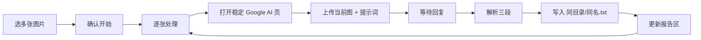

# 闲鱼上架 · Gemini 获取文案

## 范围

仅改 [`main.py`](d:\code\alexcard_tools\main.py) 与依赖文件；新增浏览器自动化逻辑模块 [`gemini_copy.py`](d:\code\alexcard_tools\gemini_copy.py)（避免把 Playwright 细节塞进已近 770 行的 `main.py`）。

## UI（沿用现有 Tab 模式）

在 [`App.__init__`](d:\code\alexcard_tools\main.py) 的 Notebook 末尾增加第四个 Tab：

- Tab 名：`闲鱼上架工具集`
- 按钮：`gmini获取文案…`
- 说明：选择多张图片，依次打开 Google Gemini 网页上传并生成闲鱼文案；结果保存为与图片同目录、同主文件名的 `.txt`；报告区显示进度。

布局继续用现有 `_add_tool_row`。

## 用户流程



1. `askopenfilenames` 多选图片（复用 `IMAGE_FILETYPES`）。
2. 确认对话框提示：将启动浏览器、需已登录 Google（首次可在弹出窗口内手动登录，之后复用本地 Playwright 用户目录）。
3. 后台线程逐张处理，避免长时间卡死 Tk 主循环；进度用 `self.after(...)` 写回 `ScrolledText`。
4. 完成后 `messagebox` 汇总成功/失败张数。

## 浏览器自动化（Playwright）

- 依赖：在 [`requirements.txt`](d:\code\alexcard_tools\requirements.txt) 增加 `playwright`；首次需用户执行 `playwright install chromium`（按钮失败时在报告区给出安装提示）。
- 使用**持久化用户目录**（如项目旁 `.playwright-gemini-profile`，并加入 `.gitignore`），以便保留 Google 登录态。
- **不复用你粘贴的整段会话 URL**（`gsessionid` / `vsrid` 会过期）。改为稳定入口：
  - `https://www.google.com.hk/search?udm=50&hl=zh-CN&q=<URL编码的固定提示词>`
  - 提示词常量：从你给的 `q=` 解码后固化为 `GEMINI_STYLE_PROMPT`（示例风格文案 +「模仿整个风格写个闲鱼售卖文案」），要求输出仍含 `【标题】` / `【宝贝描述】` / `【标签】`。
- 每张图大致步骤：
  1. `new_page` 或复用同一 page 导航到上述 URL。
  2. 定位图片上传控件（`input[type=file]` 优先；若 Google UI 无直接 file input，则点「上传图片」再设文件）。
  3. 等待生成结束（轮询回复区域出现 `【标题】` 或超时，超时可配置约 90–120s）。
  4. 取回复纯文本 → 解析 → 写文件 → 报告一行结果。

> Google 前端 DOM 易变：选择器集中在 `gemini_copy.py` 顶部常量，失败时报告区写明「未找到上传控件 / 超时未出文案」，便于后续微调。

## 解析与落盘规则

解析函数（纯逻辑、可单测）：

- 用正则按 `【标题】`、`【宝贝描述】`、`【标签】` 切三段。
- `【宝贝描述】`：按空行或单换行拆成段落，写出时**段与段之间空一行**。
- 输出文件格式示例：

```text
【标题】
……标题内容……

【宝贝描述】
第一段

第二段

第三段

【标签】
#标签1 #标签2 …
```

- 路径：`os.path.splitext(image_path)[0] + ".txt"`（与图片同目录、同主名）。
- 编码：`utf-8`。
- 缺段或解析失败：该张记失败，不覆盖已有成功文件（或仅在解析完整三段时写入）。

## 报告区文案

每张一行，例如：

- `foo.png - 已保存 foo.txt`
- `bar.jpg - 超时未生成`
- `baz.webp - 解析失败：缺少【标签】`

结尾汇总：`完成：成功 N 张，失败 M 张。`

## 主要改动文件

| 文件 | 改动 |
|------|------|
| [`main.py`](d:\code\alexcard_tools\main.py) | 新 Tab + `on_gemini_copy`（选图、确认、启线程、刷报告） |
| [`gemini_copy.py`](d:\code\alexcard_tools\gemini_copy.py) | 提示词常量、Playwright 流程、解析、写 txt |
| [`requirements.txt`](d:\code\alexcard_tools\requirements.txt) | 增加 `playwright` |
| [`.gitignore`](d:\code\alexcard_tools\.gitignore) | 忽略 `.playwright-gemini-profile/`（若尚无则新建） |

## 风险与默认处理

- 首次运行需在 Playwright 窗口登录 Google；持久化目录解决后续登录。
- 若遇验证码/风控，该张失败并继续下一张，不中断整批。
- 不做 Gemini 官方 API（按你选的 1A 网页方案）。
